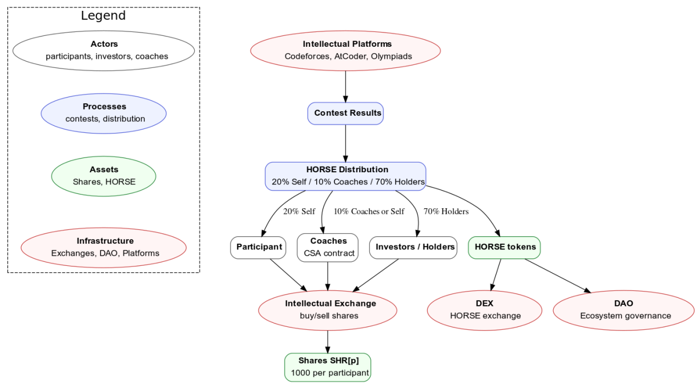

# The HORSE Project: A Concept for Tokenizing Knowledge

---

## Table of Contents

* [I. Project Overview and Core Idea](#i-project-overview-and-core-idea)
    * [1.1. Core Definition: Knowledge as a Digital Asset](#11-core-definition-knowledge-as-a-digital-asset)
    * [1.2. Architecture Synthesis: The Flow of Value](#12-architecture-synthesis-the-flow-of-value)
* [II. The Dual-Asset Economic Model](#ii-the-dual-asset-economic-model)
    * [2.1. HORSE Token: Reward, Utility, and Governance](#21-horse-token-reward-utility-and-governance)
    * [2.2. Talent Shares (SHR[p]): Investing in Future Talent](#22-talent-shares-shrp-investing-in-future-talent)
* [III. HORSE Tokenomics: Generation and Distribution](#iii-horse-tokenomics-generation-and-distribution)
    * [3.1. Meritocratic Reward Formula](#31-meritocratic-reward-formula)
    * [3.2. Automatic Reward Distribution Flow](#32-automatic-reward-distribution-flow)
* [IV. Ecosystem Functions: Support and Governance](#iv-ecosystem-functions-support-and-governance)
    * [4.1. The Intellectual Exchange and Mentorship](#41-the-intellectual-exchange-and-mentorship)
    * [4.2. Community Governance (DAO)](#42-community-governance-dao)
* [V. Conclusion](#v-conclusion)

---

## I. Project Overview and Core Idea

### 1.1. Core Definition: Knowledge as a Digital Asset

The **HORSE Project** is a decentralized system designed to recognize and reward intellectual achievements using blockchain technology. The fundamental concept is **"Learn-to-Earn" (L2E)**: turning verifiable knowledge and success in competitions (like programming or math Olympiads) into valuable digital assets. This provides a direct financial incentive to complement traditional motivation, effectively making intellectual effort a form of capital.

The system relies on established **Intellectual Platforms** (like Codeforces or AtCoder) to provide objective **Contest Results**. These results are the sole trigger for rewards, ensuring that the issuance of the **HORSE token** is strictly meritocratic and tied to real, proven intellectual achievements.

### 1.2. Architecture Synthesis: The Flow of Value

The project's architecture is best understood through the ecosystem flow diagram, which illustrates the relationship between all components, from the initial input (**Intellectual Platforms**) to the final outputs (**DEX**, **DAO**).

The project operates through a clear structure involving four key components:

| Component Group | Diagram Symbol | Role in the System | Key Elements |
| :--- | :--- | :--- | :--- |
| **Actors** | Grey | The people who generate value, invest capital, and provide mentorship. | Participants, Investors/Holders, Coaches |
| **Assets** | Green | The digital tokens and investment vehicles that represent value. | **HORSE Tokens** (Utility/Reward), **Shares** (SHR[p], Investment) |
| **Processes** | Blue | The actions that move assets and convert results into rewards. | Contest Results, **HORSE Distribution**, Intellectual Exchange |
| **Infrastructure** | Red | The technology that hosts the system and ensures decentralization and liquidity. | Intellectual Platforms, **DEX**, **DAO**, Intellectual Exchange |

The flow is direct: Intellectual Platforms provide Contest Results, which trigger the HORSE Distribution process. The resulting assets (HORSE and related shares) then move into the economic infrastructure provided by the Intellectual Exchange, the DEX, and the DAO.

---

## II. The Dual-Asset Economic Model

The HORSE Project utilizes two main digital assets to manage rewards, investment, and governance separately.

### 2.1. HORSE Token: Reward, Utility, and Governance

The **HORSE token** is the primary, liquid asset earned by Participants (students, coders, etc.) for their competitive success. It functions as the system's currency and reward unit.

* **Utility**: HORSE can be used for participation in project governance via the **DAO**, allowing holders to vote on key economic parameters and future expansions.
* **Liquidity**: The token can be exchanged on a **DEX** (Decentralized Exchange) to establish market liquidity.
* **Supply**: The HORSE token has **unlimited issuance**, based on the idea that human knowledge generation has endless potential. New tokens are created only when new achievements are verified, ensuring the supply is tied directly to real community activity.

### 2.2. Talent Shares (SHR[p]): Investing in Future Talent

**Talent Shares (SHR[p])** are unique digital shares (**NFTs**) designed to represent a fractional stake in an individual participant's future earnings.

* **Investment**: Each participant receives **1,000 shares (SHR[p])**. These are tradable on the **Intellectual Exchange**, allowing **Investors/Holders** (sponsors, parents, etc.) to financially support promising talent.
* **Capital Formation**: This mechanism functions like a simple investment contract, providing talented individuals with upfront funding or financial support by selling a percentage of their future token rewards.

---

## III. HORSE Tokenomics: Generation and Distribution

### 3.1. Meritocratic Reward Formula

The reward calculation uses a **non-linear formula** that strongly favors high achievement. This ensures that the winners and top performers receive disproportionately more tokens, stimulating the pursuit of excellence.

The reward distribution formula is based on three main variables:

$$Reward = \frac{(\frac{P-S+1}{P})^3 \times K \times 10}{M}$$

Where:

* **P**: The total number of people who successfully solved at least one problem in the contest.
* **S**: The participant’s rank (1 being the winner).
* **K**: A coefficient that adjusts the reward based on the competition’s difficulty level (e.g., easy contests have a smaller K).
* **M**: The number of people in the user's team. This ensures that team rewards are divided among all team members.

The exponent, currently set at **3 (the cubic factor)**, is the primary leverage point. The **DAO** can potentially adjust this exponent to fine-tune the reward difference between high and average results. This guarantees that small improvements at the top ranks result in significantly larger rewards.

### 3.2. Automatic Reward Distribution Flow

When a participant earns HORSE tokens from verified Contest Results, the protocol's smart contract automatically distributes the reward into three streams, clearly shown in the distribution process:

* **20% (Self)**: Goes directly to the **Participant** as immediate compensation.
* **10% (Coaches)**: Goes to the assigned **Coach or Mentor**, financially rewarding them for their intellectual contribution and experience exchange. If no coach is assigned, this goes to the participant ("Self").
* **70% (Holders)**: Distributed proportionally among all owners of the participant's **SHR[p] shares**, acting as a direct investment dividend.

This strategic distribution is designed to simultaneously incentivize the participant (20%), reward mentorship (10%), and attract investment capital (70%) to the talent economy.

---

## IV. Ecosystem Functions: Support and Governance

### 4.1. The Intellectual Exchange and Mentorship

The **Intellectual Exchange** is where the **Actors**—Participants, Coaches, and Investors—interact to trade the Shares (SHR[p]).

* **Investment**: Investors provide capital by buying shares, which grants them the right to the **70% future earnings dividend**. This funding helps participants overcome financial barriers.
* **Mentorship**: The project provides an automated financial incentive for mentorship, ensuring that Coaches receive a percentage of their students' earnings (10%). This aligns the financial interests of the coach directly with the success of their mentee.

### 4.2. Community Governance (DAO)

The **DAO** (Decentralized Autonomous Organization) is the project’s governance mechanism, granting all HORSE token holders a voice in its future.

* **Economic Control**: The DAO's primary long-term function is to manage the **unlimited token supply**. Token holders vote on changes to the $K$ parameter (competition difficulty coefficient) and potentially the degree of the meritocratic exponent in the reward formula, controlling the issuance rate and maintaining the token's value stability.
* **Strategic Expansion**: The community votes on key decisions, such as integrating new Intellectual Platforms (like expanding to math Olympiads), allocating ecosystem funds, and implementing major protocol updates.

---

## V. Conclusion

The HORSE Project connects intellectual achievement directly to economic value, utilizing a sophisticated dual-asset structure (HORSE for utility/reward, SHR[p] for investment) and a highly meritocratic reward system. By integrating established competitive platforms and adopting decentralized governance via the **DAO**, HORSE aims to build a sustainable, self-regulating ecosystem where the value of human capital is fairly recognized and rewarded.
